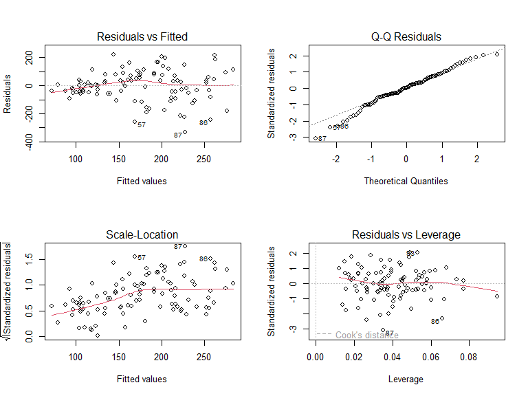
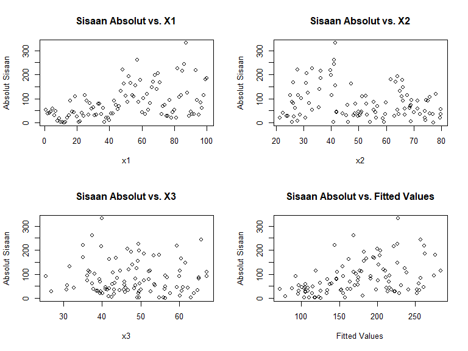

Analisis Regresi Linier dengan WLS
================
Analisis oleh Ferdian Bangkit Wijaya,
2 September 2025.

## Pendahuluan

Dokumen ini merupakan kelanjutan dari analisis regresi OLS. Tujuannya
adalah untuk membangun model regresi menggunakan metode Weighted Least
Squares (WLS). WLS adalah metode yang tepat digunakan ketika asumsi
homoskedastisitas (varians sisaan yang konstan) pada model OLS tidak
terpenuhi.

WLS bekerja dengan memberikan “bobot” yang berbeda pada setiap
observasi. Observasi dengan varians sisaan yang lebih besar (kurang
dapat diandalkan) akan diberi bobot lebih kecil, dan sebaliknya.

## Memuat Paket dan Data

``` r
library(lmtest)
library(car)
library(nlme)
library(readxl)
```

## Mengimpor Data dari File Excel

``` r
# Ganti path file di bawah ini!
file_path <- "C:/Users/user/OneDrive - untirta.ac.id/R Script/Github_Regresi_OLS/data_simulasi_gls.xlsx"
data_WLS <- read_excel(file_path)
```

## Menampilkan Data yang diimport

``` r
knitr::kable(head(data_WLS), caption = "Pratinjau 6 Baris Pertama Data")
```

|        y |  x1 |       x2 |       x3 | time |
|---------:|----:|---------:|---------:|-----:|
| 44.24526 |   1 | 63.95721 | 53.70892 |    1 |
| 35.03337 |   2 | 48.54569 | 37.71991 |    2 |
| 47.91869 |   3 | 50.85295 | 48.37802 |    3 |
| 59.39113 |   4 | 49.90594 | 60.88072 |    4 |
| 45.62189 |   5 | 66.81707 | 53.59201 |    5 |
| 76.92317 |   6 | 50.25513 | 60.67191 |    6 |

Pratinjau 6 Baris Pertama Data

## Membangun Model OLS Awal (Untuk Diagnosis)

``` r
# Model OLS sama seperti file sebelumnya
model_ols_awal <- lm(y ~ x1 + x2 + x3, data = data_WLS)
```

## Uji Asumsi Klasik (Diagnostik Sisaan)

``` r
par(mfrow = c(2, 2))
plot(model_ols_awal)
```

<!-- -->

``` r
par(mfrow = c(1, 1))
```

Uji Normalitas (Shapiro-Wilk)

Tujuan: Menguji apakah sisaan model berdistribusi normal.

Hipotesis:

H_0: Sisaan berdistribusi normal.

H_1: Sisaan tidak berdistribusi normal.

Kriteria Keputusan: Tolak H_0 jika p-value \< 0.05. Asumsi normalitas
terpenuhi jika kita gagal menolak H_0 (p-value \> 0.05).

``` r
print(shapiro.test(residuals(model_ols_awal)))
```

    ## 
    ##  Shapiro-Wilk normality test
    ## 
    ## data:  residuals(model_ols_awal)
    ## W = 0.98311, p-value = 0.2304

Uji Homoskedastisitas (Breusch-Pagan)

Tujuan: Menguji apakah varians dari sisaan konstan (homoskedastisitas)
atau tidak (heteroskedastisitas).

Hipotesis:

H_0: Varians sisaan konstan (homoskedastisitas).

H_1: Varians sisaan tidak konstan (terdapat heteroskedastisitas).

Kriteria Keputusan: Tolak H_0 jika p-value \< 0.05. Asumsi
homoskedastisitas terpenuhi jika kita gagal menolak H_0 (p-value \>
0.05).

``` r
print(bptest(model_ols_awal))
```

    ## 
    ##  studentized Breusch-Pagan test
    ## 
    ## data:  model_ols_awal
    ## BP = 20.185, df = 3, p-value = 0.0001554

Uji Autokorelasi (Durbin-Watson)

Tujuan: Menguji apakah ada korelasi antar sisaan pada observasi yang
berdekatan. Autokorelasi umumnya menjadi masalah pada data deret waktu
(time series).

Hipotesis:

H_0: Tidak ada autokorelasi (koefisien autokorelasi = 0).

H_1: Terdapat autokorelasi.

Kriteria Keputusan: Tolak H_0 jika p-value \< 0.05. Asumsi independensi
sisaan terpenuhi jika kita gagal menolak H_0 (p-value \> 0.05).

``` r
print(dwtest(model_ols_awal))
```

    ## 
    ##  Durbin-Watson test
    ## 
    ## data:  model_ols_awal
    ## DW = 0.74077, p-value = 5.116e-11
    ## alternative hypothesis: true autocorrelation is greater than 0

Uji Multikolinearitas (VIF)

Tujuan: Mendeteksi adanya korelasi yang tinggi antar variabel
independen.

Hipotesis: Uji VIF tidak menggunakan hipotesis H_0/H_1 dan p-value.

Kriteria Keputusan: Menggunakan aturan praktis (rule of thumb). Nilai
Variance Inflation Factor (VIF) \> 5 atau 10 mengindikasikan adanya
masalah multikolinearitas.

Harapan: Nilai VIF untuk setiap variabel independen di bawah 5.

``` r
print(vif(model_ols_awal))
```

    ##       x1       x2       x3 
    ## 1.007994 1.002954 1.010958

## Diagnosis Visual untuk Menentukan Sumber Heteroskedastisitas

``` r
# Dapatkan nilai absolut dari sisaan model OLS
sisaan_abs <- abs(residuals(model_ols_awal))

# Dapatkan nilai prediksi (fitted values) dari model OLS
fitted_vals <- fitted(model_ols_awal)

# Atur layout plot menjadi 2x2
par(mfrow = c(2, 2))

# Plot sisaan absolut vs setiap prediktor dan fitted values
plot(data_WLS$x1, sisaan_abs, main = "Sisaan Absolut vs. X1", xlab = "x1", ylab = "Absolut Sisaan")
plot(data_WLS$x2, sisaan_abs, main = "Sisaan Absolut vs. X2", xlab = "x2", ylab = "Absolut Sisaan")
plot(data_WLS$x3, sisaan_abs, main = "Sisaan Absolut vs. X3", xlab = "x3", ylab = "Absolut Sisaan")
plot(fitted_vals, sisaan_abs, main = "Sisaan Absolut vs. Fitted Values", xlab = "Fitted Values", ylab = "Absolut Sisaan")
```

<!-- -->

``` r
# Kembalikan layout ke default
par(mfrow = c(1, 1))
```

## Keputusan Skema Pembobotan (Weighting Scheme)

Kita membuat keputusan tentang bagaimana cara menghitung bobot.

Aturan umum yang digunakan adalah: [Aturan Bobot
W](https://github.com/ferdianwijayabangkit/supervised_learning-perkuliahan/blob/main/SPL-Perbandingan%20OLS%2C%20WLS%2C%20GLS.pdf)

``` r
# Menghitung bobot berdasarkan keputusan dari analisis visual
# Penting: Metode ini mengasumsikan semua nilai x1 adalah positif.
bobot_wls <- 1 / data_WLS$x1^2
```

## Pemodelan WLS dan Uji Asumsi Ulang

``` r
# Membangun model WLS
model_wls <- lm(y ~ x1 + x2 + x3, data = data_WLS, weights = bobot_wls)

# Menampilkan ringkasan model WLS
summary(model_wls)
```

    ## 
    ## Call:
    ## lm(formula = y ~ x1 + x2 + x3, data = data_WLS, weights = bobot_wls)
    ## 
    ## Weighted Residuals:
    ##     Min      1Q  Median      3Q     Max 
    ## -5.1444 -1.5416  0.1138  1.6125  4.7730 
    ## 
    ## Coefficients:
    ##             Estimate Std. Error t value Pr(>|t|)    
    ## (Intercept)   7.2586    14.7750   0.491 0.624354    
    ## x1            2.9778     0.2481  12.005  < 2e-16 ***
    ## x2           -0.4109     0.2392  -1.718 0.089029 .  
    ## x3            1.1321     0.2969   3.814 0.000242 ***
    ## ---
    ## Signif. codes:  0 '***' 0.001 '**' 0.01 '*' 0.05 '.' 0.1 ' ' 1
    ## 
    ## Residual standard error: 2.188 on 96 degrees of freedom
    ## Multiple R-squared:  0.6423, Adjusted R-squared:  0.6311 
    ## F-statistic: 57.45 on 3 and 96 DF,  p-value: < 2.2e-16

``` r
# Uji Normalitas pada sisaan WLS
print(shapiro.test(residuals(model_wls)))
```

    ## 
    ##  Shapiro-Wilk normality test
    ## 
    ## data:  residuals(model_wls)
    ## W = 0.93574, p-value = 0.000107

``` r
# Uji Kehomogenan pada sisaan WLS
print(bptest(model_wls))
```

    ## 
    ##  studentized Breusch-Pagan test
    ## 
    ## data:  model_wls
    ## BP = 0.0064806, df = 3, p-value = 0.9999

``` r
# Uji Autokorelasi pada sisaan WLS

print(car::durbinWatsonTest(model_wls))
```

    ##  lag Autocorrelation D-W Statistic p-value
    ##    1       0.6888105     0.6146814       0
    ##  Alternative hypothesis: rho != 0

``` r
# Uji Multikolinearitas (nilai VIF tidak akan berubah)
print(vif(model_wls))
```

    ##       x1       x2       x3 
    ## 1.074101 1.445826 1.361017

## Evaluasi Kebaikan Model (Goodness-of-Fit)

``` r
r_squared_wls <- summary(model_wls)$r.squared
adj_r_squared_wls <- summary(model_wls)$adj.r.squared
model_aic_wls <- AIC(model_wls)
model_bic_wls <- BIC(model_wls)

evaluasi_wls <- data.frame(
  Metrik = c("R-squared", "Adjusted R-squared", "AIC", "BIC"),
  Nilai = c(r_squared_wls, adj_r_squared_wls, model_aic_wls, model_bic_wls)
)

knitr::kable(evaluasi_wls, caption = "Metrik Kebaikan Model (Goodness-of-Fit) untuk WLS")
```

| Metrik             |        Nilai |
|:-------------------|-------------:|
| R-squared          |    0.6422657 |
| Adjusted R-squared |    0.6310865 |
| AIC                | 1173.7468391 |
| BIC                | 1186.7726900 |

Metrik Kebaikan Model (Goodness-of-Fit) untuk WLS
